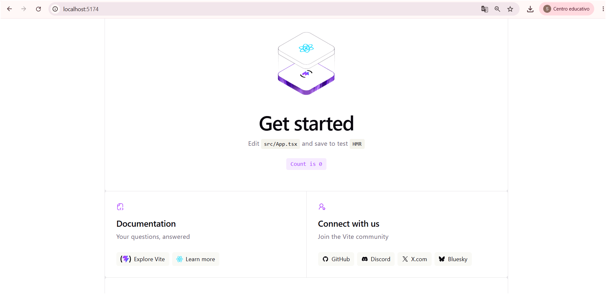
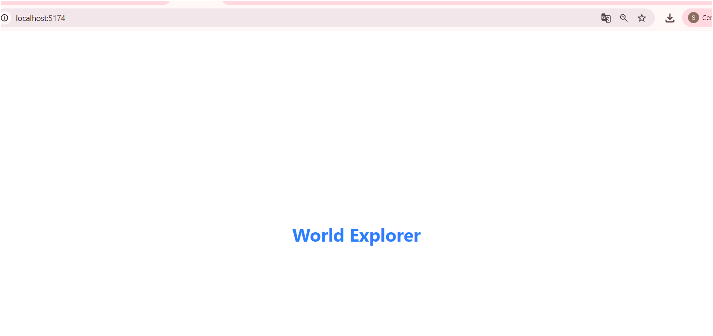
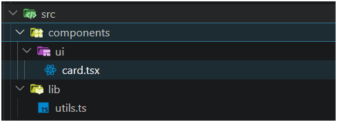
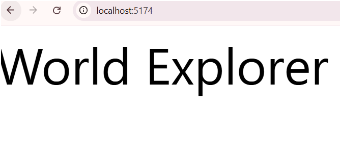
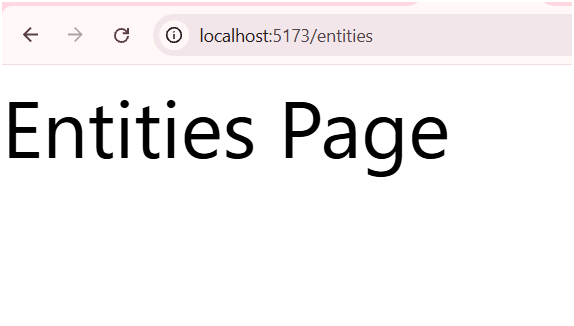
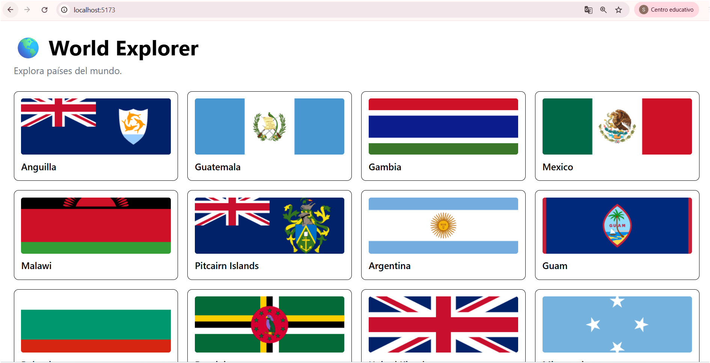
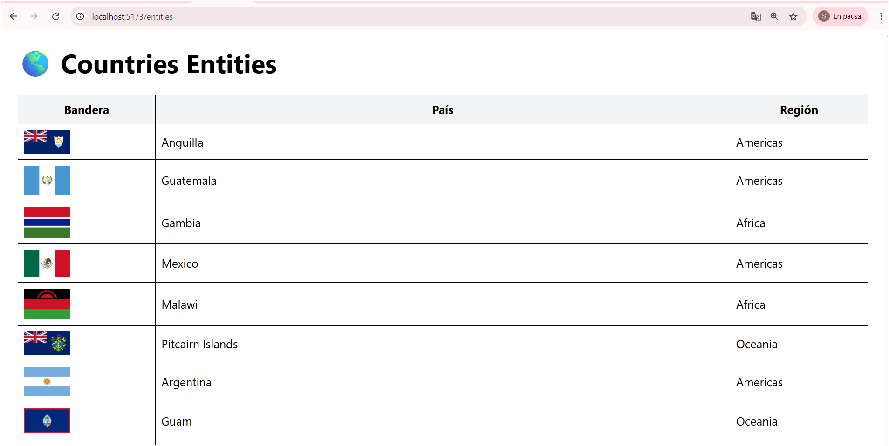
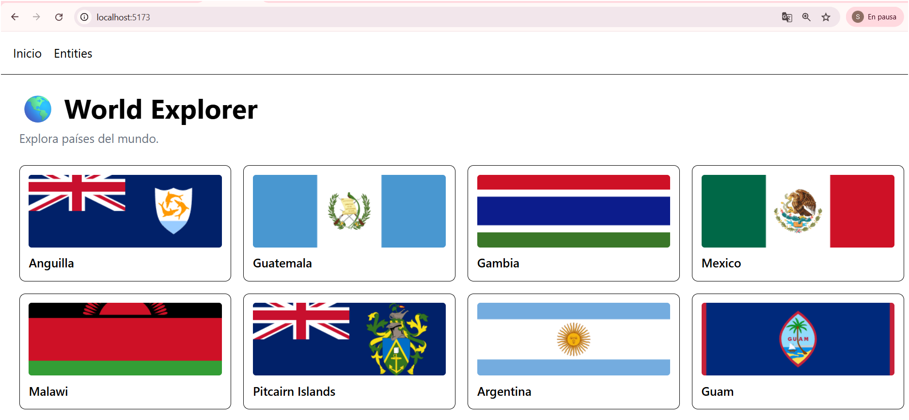
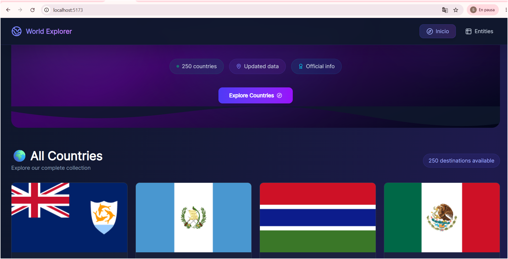

# 🌎 World Explorer

Aplicación web desarrollada con React y TypeScript que consume información de países desde la API pública Rest Countries. Permite explorar países del mundo mostrando su bandera, nombre y región mediante una interfaz sencilla y moderna.

## 🚀 Tecnologías utilizadas

* React
* TypeScript
* Vite
* Tailwind CSS
* Shadcn UI
* React Router DOM
* Axios
* Git & GitHub

---

## 📦 Instalación

Clonar el repositorio:

```bash
git clone https://github.com/TU-USUARIO/countries-react.git
```

Ingresar al proyecto:

```bash
cd countries-react
```

Instalar dependencias:

```bash
npm install
```

Ejecutar el proyecto:

```bash
npm run dev
```

Abrir en el navegador:

```txt
http://localhost:5173
```

---

## ✨ Funcionalidades

* Consumo de API pública Rest Countries.
* Visualización de países y banderas.
* Página Home con catálogo de países.
* Página Entities mostrando múltiples propiedades.
* Navegación mediante React Router.
* Estilos utilizando Tailwind CSS y Shadcn UI.
* Estructura organizada y escalable.

---

## 📸 Evidencias del desarrollo

### 1. Proyecto creado con Vite y TypeScript



### 2. Configuración de Tailwind CSS



### 3. Configuración de Shadcn UI



### 4. Configuración de rutas



### 5. Ruta Entities



### 6. Consumo de API



### 7. Vista Entities



### 8. Navegación


## Interfaz mejorada


---

## 🌐 Deploy

Pendiente de agregar enlace de Vercel.

```txt
https://tu-proyecto.vercel.app
```

---

## 🎥 Video demostrativo

Pendiente de agregar enlace de YouTube.

```txt
https://youtube.com/...
```

---

## 📁 Estructura del proyecto

```txt
src
├── components
│   └── ui
├── layouts
├── pages
├── routes
├── services
├── types
├── App.tsx
└── main.tsx
```

---

## 👨‍💻 Autor

Desarrollado como parte de la evaluación práctica de React utilizando React + TypeScript + Vite.
